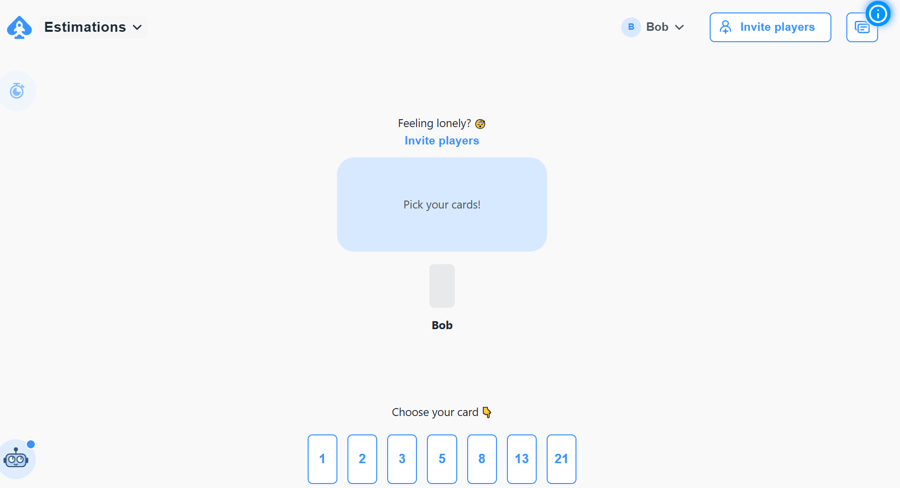
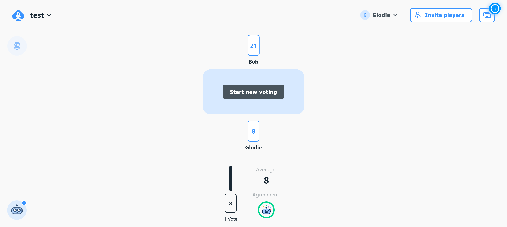

# Exercice 10 : estimations avec le Planning Poker

---

## Modalités

- Reportez vos **stories points** sur vos **user stories** en sauvergadant à la fin du vote ou via la saisie manuelle (demo effectué en cours).

---

## Énoncé

À partir de votre *product backlog* : 

1. Priorisez (***Highest > High > Medium > Low > Lowest***) vos *US*
2. Estimez la complexité des d'au moins 3 *US* les plus prioritaires (***Highest***) en utilisant l'extension Planning Poker sur JIRA.
- En cas d'écart, confrontez les membres de l'équipe qui ont voté aux extrêmes (note la plus basse et note la plus élevée) pour avoir les arguments de chacun et revotez à nouveau en tenant compte de l'échange. Dans le cas où vous n'arriveriez pas à vous mettre d'accord après le 3e tour de vote sur le même ticket, mettez le score le plus élevée au ticket.

## Mise en place du Planning Poker

1. Gardez la suite de Fibonacci pour les estimations avec uniquement les valeurs 1, 2, 3, 5, 8, 13 et 21.
2. Partagez le lien du vote à tous les membres de l'équipe.
3. Votez et débattre en ne dépassant pas 1 à 2 minutes d'argumentation pour les membres qui ont voté aux extrêmes.
4. Reportez le story point (le score) sur US concernée.
5. Prenez un autre ticket et refaite les étapes précédentes.

---

