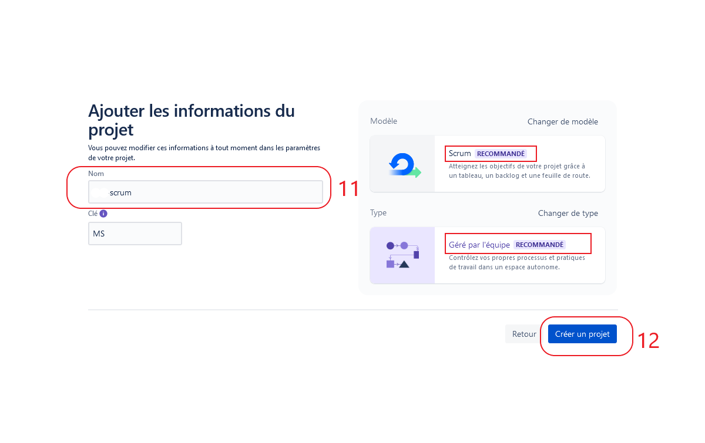
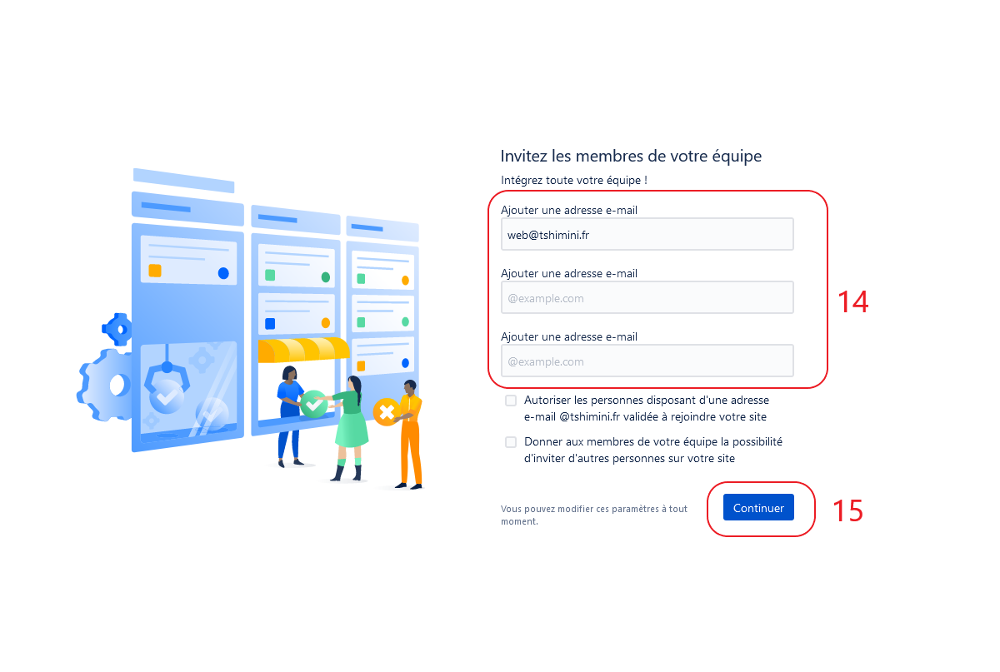

# Jira

Logiciel de gestion de projet agile.

---

## Mise en place

1. Dans chaque groupe, désignez un responsable qui aura le rôle du *SCRUM Master* durant toute la série des exercices.
2. Les autres membres de l'équipe (tous les autres en dehors du *SCRUM Master*) doivent créer un compte à partir du [lien suivant](https://id.atlassian.com/signup)

---

## Création projet Jira

Désignez un responsable qui aura le rôle de SCRUM Master que l'on verra un peu plus en détail durant ce cours qui doit effectuer les tâches ci-dessous.

1. Créez un projet Jira depuis ce [lien](https://www.atlassian.com/fr/software/jira/free) en suivant les indications du site et en s'appuyant sur les captures d'écran ci-après.
2. À la fin de la création du projet :
- Invitez les autres membres du groupe en saisissant leurs adresses e-mails pour participer au projet
- Invitez le formateur en saisissant l'adresse e-mail `contact@tshimini.fr`
- Ajoutez l'extension *Story mapping*

- Ajoutez l'extension *Planning Poker*

---

### Illustrations création d'un compte et d'un projet Jira

